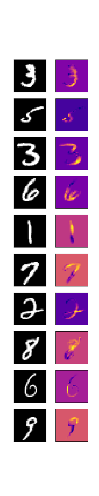

# mazemaze
人工ニューラルネットワークを用いた画像識別において、ネットワークを特徴抽出器と識別器に分け、特徴抽出器の学習に用いる画像を識別対象でない画像で学習する。

# LRP
[Layer-wise Relevance Propagation](https://arxiv.org/abs/1604.00825)

# Requirements
chainer 2.0.0

use [fashion-mnist](https://github.com/zalandoresearch/fashion-mnist)

tensorflow

